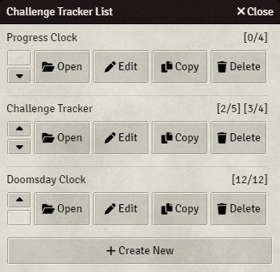

 [](https://forge-vtt.com/bazaar#package=challenge-tracker)

# Challenge Tracker
An interactive aid to track successes and failures in challenges à la D&D 4e-inspired skill challenges and Blades in the Dark progress clocks.


# Features
- **Versatile:** Works for D&D 4e-inspired skill challenges, Blades in the Dark progress clocks, or as a resource/countdown tracker.
- **Click to Fill:** Left-click anywhere within the ring or circle to fill a segment in that area. Right-click  to clear a segment.
- **Scroll to Change:** Hover over the ring or circle and use your mouse wheel, or the +/- keys, to increase or decrease the number of segments.
- **Player View:** Click **Show** on the header to show the tracker to other players and click **Hide** to hide it from other players.

# How to Use
## Using the Challenge Tracker List
1. Click the  button in the player list to open the Challenge Tracker List.

   

   

2. Click 'Create New' to create a new Challenge Tracker.
3. Fill in the options and click 'Save and Close'.
- Click 'Open' to open a Challenge Tracker.
- Click 'Copy' to copy an existing Challenge Tracker.
- Click 'Edit' to edit an existing Challenge Tracker.
- Click 'Delete' to delete an existing Challenge Tracker.

## Using Macros
1. Create a macro with a Type of 'script' and enter: 
   ```
   ChallengeTracker.open(outer, inner)
   ```
   *`outer` is the number of segments required on the outer ring (successes) and `inner` is the number of segments required on the inner circle (failures).*

2. Execute the macro to open the Challenge Tracker.


# Module Settings
Module settings are found in Foundry VTT under Game Settings > Configure Settings > Module Settings > Challenge Tracker.

### **Frame Color**
Set the default color of the frame. Default is #0f1414.

### **Outer Color**
Set the default color of the outer ring. Default is #228b22ff.

### **Outer Background**
Set the default background color of the outer ring. Default is #1b6f1b66.

### **Inner Color**
Set the default color of the inner circle. Default is #dc0000ff.

### **Inner Background Color**
Set the default background color of the inner circle. Default is #b0000066.

### **Display Button**
Display the Challenge Tracker button to users with the selected role and above. Default is Player.

### **Button Location**
Set the location of the Challenge Tracker button. Default is Player List.

### **Allow Show to Others**
Allows users with the selected role (and above) to show Challenge Trackers to others. Default is false.

### **Size**
Set the default size of the Challenge Tracker in pixels. Default is 400.

### **Frame Width**
Set the width of the frame. Default is Medium.

### **Scroll**
Enable the scroll wheel for increasing or decreasing segments. Default is true.

## **Windowed**
Set Challenge Trackers to windowed by default. Default is true.

# Advanced Options
More options can be set  using an optional array parameter: `ChallengeTracker.open(successes failures, {options})` where options is a comma-separated list of any of the following parameters in the format `option: value`:

### **backgroundImage**
Set the background/unset image of the challenge tracker

Example `backgroundImage: 'https://.../images/vintage-clock-face.webp'`

### **closeFunction**
Execute a function when a Challenge Tracker is closed.

Example `closeFunction: () => { ui.notifications.info('Goodbye!') }`

### **foregroundImage**
Set the foreground/set image of the challenge tracker

Example `foregroundImage: 'https://.../images/vintage-clock-face.webp'`

### **frameColor**
Set the hex color of the frame. The 'Frame Color' module setting will be ignored.

Example: `frameColor: '#0000FF'`

### **frameWidth**
Set the width of the frame. The 'Frame Width' module setting will be ignored.

Options are:
- 'none'
- 'extra-thin'
- 'thin'
- 'medium'
- 'thick'

Example: `frameWidth: 'thin'`

### **innerBackgroundColor**
Set the background hex color of the inner circle (failures). The 'Inner Background Color' module setting will be ignored.

Example: `innerBackgroundColor: '#b0000066'`

### **innerColor**
Set the hex color of the inner circle (failures). The 'Inner Color' module setting will be ignored.

Example: `innerColor: '#dc0000ff'`

### **id** 
Set to the ID of an existing Challenge Tracker to open that Challenge Tracker. Other options included will overwrite the Challenge Tracker's previous options.

Example: `id: 'challenge-tracker-8b814267e7dfa`

### **innerCurrent**
Set the number of completed segments on the inner circle (failures). Default is `0`.

Example: `innerCurrent: 3`

### **openFunction**
Execute a function when a Challenge Tracker is opened.

Example `openFunction: () => { ui.notifications.info('Hello!') }`

### **outerBackgroundColor**
Set the background hex color of the outer ring (successes). The 'Outer Background Color' module setting will be ignored.

Example: `outerBackgroundColor: '#1B6F1B66'`

### **outerColor**
Set the hex color of the outer ring (successes). The 'Outer Color' module setting will be ignored.

Example: `outerColor: '#0000FF'`

### **outerCurrent**
Set the number of completed segments on the outer ring (successes). Default is `0`.

Example: `outerCurrent: 3`

### **persist**
Set to `true` to persist the Challenge Tracker across sessions. Default is `false`.

Example: `persist: true`

### *scroll**
Set to `true` to enable the scroll wheel for increasing or decreasing segments. Default is `true`.

Example: `scroll: false`

### **show**
Set to `true` to show the Challenge Tracker to your players. Default is `false`. This option will be ignored when the user's role is not equal to or greater than the role selected in the 'Allow Show to Others' module setting.

Example: `show: true`

### **size**
Set the size of the Challenge Tracker in pixels between 200 to 600. The 'Size' module setting will be ignored.

Example: `size: 400`
### **title**
Set the title of the Challenge Tracker in the window header. Default is `Challenge Tracker`.

Example: `title: 'Skill Challenge 1'`

### **windowed**
Set the Challenge Tracker to windowed (true) or windowless (false). The 'Windowed' module setting will be ignored.

Example: `windowed: false`

# Functions

### **ChallengeTracker.open(*outer*, *inner*, {*options*})**
Open a Challenge Tracker.

Also accepts `ChallengeTracker.open(outer, {options})` or `ChallengeTracker.open({options})`. See *Using Macros* for more info.

Examples:
- `ChallengeTracker.open(4, 3, { title: 'Skills Challenge L1' })`
- `ChallengeTracker.open(8, { title: 'Progress Clock' })`
- `ChallengeTracker.open({ outerTotal: 6, innerTotal: 3, title: 'Social Conflict', frameColor: game.user.color })`

### **ChallengeTracker.setById(*id*, {*options*})**
Set the options of a Challenge Tracker by its ID.

Example: `ChallengeTracker.setById('challenge-tracker-8b814267e7dfa', { outerCurrent: 3 })`

### **ChallengeTracker.setByTitle(*title*, {*options*})**
Set the options of a Challenge Tracker by its title. Only the first Challenge Tracker with a matching title will be set.

Example: `ChallengeTracker.setById('Challenge Tracker', { outerCurrent: 3 })`

### **ChallengeTracker.getById(*id*)**
Get the options of a Challenge Tracker by its ID.

Example: `const challengeTrackerOptions = ChallengeTracker.getById('challenge-tracker-8b814267e7dfa')`

### **ChallengeTracker.getByTitle(*title*)**
Get the options of a Challenge Tracker by its title. Only the first Challenge Tracker with a matching title will be returned.

Example: `const challengeTrackerOptions = ChallengeTracker.getByTitle('Challenge Tracker')`

### **ChallengeTracker.closeAll()**
 Close all Challenge Trackers.
 
 Example: `ChallengeTracker.closeAll()`

### **ChallengeTracker.closeById(*id*)**

Close a Challenge Tracker by its ID.

Example: `ChallengeTracker.closeById('challenge-tracker-8b814267e7dfa')`

### **ChallengeTracker.closeByTitle(*title*)**
Close a Challenge Tracker by its title. Only the first Challenge Tracker with a matching title will be closed. 

Example: `ChallengeTracker.closeById('Challenge Tracker')`

### **ChallengeTracker.deleteAll()**
Delete all Challenge Trackers. Open Challenge Trackers will not be closed.

Example: `ChallengeTracker.deleteAll()`

### **ChallengeTracker.deleteById(*id*)**

Delete a Challenge Tracker by its ID. An open Challenge Tracker will not be closed.

Example: `ChallengeTracker.deleteById('challenge-tracker-8b814267e7dfa')`

### **ChallengeTracker.deleteByTitle(*title*)**
Delete a Challenge Tracker by its title. Only the first Challenge Tracker with a matching title will be deleted. An open Challenge Tracker will not be closed.

Example: `ChallengeTracker.deleteByTitle('Challenge Tracker')`

### **ChallengeTracker.showAll()**
Show all open Challenge Trackers to other players.

Example: `ChallengeTracker.showAll()`

### **ChallengeTracker.showById(*id*)**
Show an open Challenge Tracker to other players by its ID.

Example: `ChallengeTracker.showByID('challenge-tracker-8b814267e7dfa')`

### **ChallengeTracker.showByTitle(*title*)**
See also: `ChallengeTracker.show(title)`

Show an open Challenge Tracker to other players by its title. Only the first Challenge Tracker with a matching title will be shown.

Example: `ChallengeTracker.showByTitle('Challenge Tracker')`

### **ChallengeTracker.hideAll()**
Hide all open Challenge Trackers from other players.

Example: `ChallengeTracker.hideAll()`

### **ChallengeTracker.hideById(*id*)**
Hide an open Challenge Tracker by its ID.

Example: `ChallengeTracker.hideById('challenge-tracker-8b814267e7dfa')`

### **ChallengeTracker.hideByTitle(*title*)**
Hide an open Challenge Tracker by its title. Only the first Challenge Tracker with a matching title will be hidden.

Example: `ChallengeTracker.hideByTitle('Challenge Tracker')`

### **ChallengeTracker.openList()**
Open the Challenge Tracker list. GMs can use pass a username to the function to open that user's list.

Examples:
- `ChallengeTracker.openList()`
- `ChallengeTracker.openList('Larkinabout')`

# Example Challenge Trackers
### Progress Clock
`ChallengeTracker.open(4, {show: true, frameWidth: 'none', outerBackgroundColor: '#00000000', outerColor: '#00000000', backgroundImage: 'modules/challenge-tracker/presets/blades-in-the-dark/blades-in-the-dark-4-white.webp', foregroundImage: 'modules/challenge-tracker/presets/blades-in-the-dark/blades-in-the-dark-black.webp', size: 150, title: 'Progress Clock'})`  


### Doomsday Clock
`ChallengeTracker.open(12, {show: true, frameWidth: 'none', outerBackgroundColor: '#00000000', outerColor: '#00000000', backgroundImage: 'modules/challenge-tracker/presets/misc/blessed-landscape.webp', foregroundImage: 'modules/challenge-tracker/presets/misc/doomed-landscape.webp', title: 'Doomsday Clock'})`  


