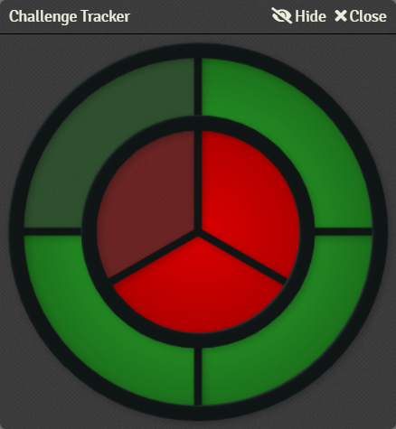

# Challenge Tracker
An interactive aid to track successes and failures in challenges à la D&D 4e-inspired skill challenges and Blades in the Dark progress clocks.

 

## Features
- **Versatile:** Works for D&D 4e-inspired skill challenges, Blades in the Dark progress clocks, or as a resource/countdown tracker.
- **Click to Fill:** Left-click anywhere within the ring or circle to fill a segment in that area. Right-click  to clear a segment.
- **Scroll to Change:** Hover over the ring or circle and use your mouse wheel, or the +/- keys, to increase or decrease the number of segments.
- **Player View:** Click **Show** on the header to show the tracker to other players and click **Hide** to hide it from other players.

## How to Use
### Using the Player List

1. Click the  button in the player list.

   

2. Click 'Create New' to create a new Challenge Tracker.
3. Fill in the options and click 'Save and Close'.
    - Click 'Open' to open a Challenge Tracker.
    - Click 'Edit' to edit an existing Challenge Tracker.
    - Click 'Delete' to delete an existing Challenge Tracker.

### Using Macros
1. Create a macro with a Type of 'script' and enter: `ChallengeTracker.open(outer, inner)` where `outer` is the number of segments required on the outer ring (successes) and `inner` is the number of segments required on the inner circle (failures).
2. Execute the macro to open the Challenge Tracker.

## Advanced Options
More options can be set  using an optional array parameter: `ChallengeTracker.open(successes failures, {options})` where options is a comma-separated list of any of the following parameters in the format `option: value`:
- **outerCurrent:** Set the number of completed segments on the outer ring (successes). Default is `0`. Example: `outerCurrent: 3
- **innerCurrent:** Set the number of completed segments on the inner circle (failures). Default is `0`. Example: `innerCurrent: 
- **outerBackgroundColor:** Set the background hex color of the outer ring (successes). The 'Outer Background Color' module setting will be ignored. Example: `outerBackgroundColor: '#1B6F1B66'`
- **outerColor:** Set the hex color of the outer ring (successes). The 'Outer Color' module setting will be ignored. Example: `outerColor: '#0000FF'`
- **innerColor:** Set the hex color of the inner circle (failures). The 'Inner Color' module setting will be ignored.
- **innerBackgroundColor:** Set the background hex color of the inner circle (failures). The 'Inner Background Color' module setting will be ignored. Example: `innerBackgroundColor: '#B0000066'`
- **frameColor:** Set the hex color of the frame. The 'Frame Color' module setting will be ignored. Example: `frameColor: '#0000FF'`
- **persist:** Set to `true` to persist the Challenge Tracker across sessions. Default is `false`. This option will be ignored when the user's role is not equal to or greater than the role selected in the 'Allow Show to Others' module setting. Example: `persist: true`
- **show:** Set to `true` to show the Challenge Tracker to your players. Default is `false`. Example: `show: true`
- **size:** Set the size of the Challenge Tracker in pixels between 200 to 600. The 'Size' module setting will be ignored. Example: `size: 400`
- **title:** Set the title of the Challenge Tracker in the window header. Default is `Challenge Tracker`. Example: `title: 'Skill Challenge 1'`
- **windowed:** Set the Challenge Tracker to windowed (true) or windowless (false). The 'Windowed' module setting will be ignored. Example: `windowed: false`

## Examples
### Progress Clock
`ChallengeTracker.open(8, 0, {show: true, title: 'Progress Clock'})`

### Health & Mana
`ChallengeTracker.open(10, 5, {show: true, outerCurrent: 10, innerCurrent: 5, outerColor: '#DC0000', innerColor: '#0040FF', title: 'Health & Mana'})`  

